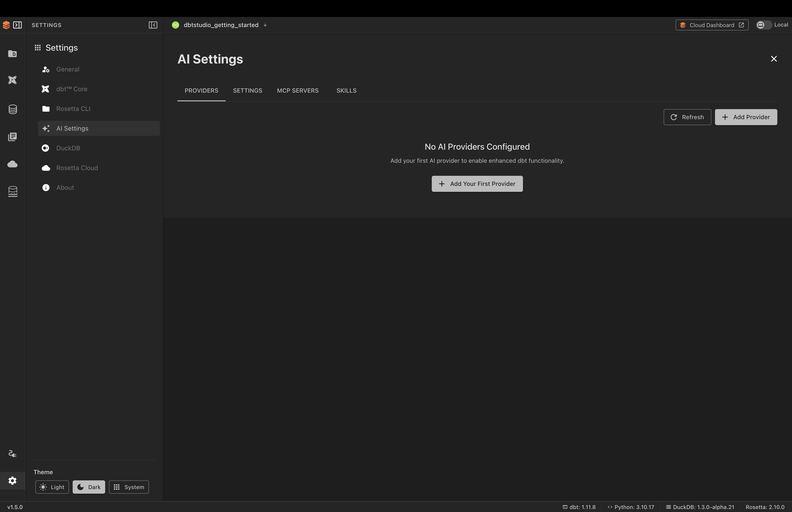

# AI Integration Guide

## Overview

Rosetta DBT Studio includes built-in AI assistance to help you generate dbt™ models, write SQL queries, and automate data transformations. To use the AI features you need to connect at least one AI provider.

---

## Supported AI Providers

| Provider | API Key |
|----------|---------|
| **Google Gemini** | [aistudio.google.com](https://aistudio.google.com) |
| **OpenAI** | [platform.openai.com](https://platform.openai.com) |
| **Anthropic** | [console.anthropic.com](https://console.anthropic.com) |
| **Ollama** | No API key required |

---

## Setup

### Step 1 — Open AI Settings

1. Click **Settings** at the bottom of the left sidebar
2. Click **AI Settings**



---

### Step 2 — Add a Provider

1. Click **Add Your First Provider**
2. Fill in the fields:
   - **Provider Name** — a label for your reference
   - **Provider Type** — select your provider from the dropdown
   - **API Key** — paste your key here
3. Click **Test Connection** to verify your key works


4. Click **Create Provider**

---

### Step 3 — Select a Model and Set Active

1. Click **Edit** on your provider card
2. Open the **Default Model** dropdown and select a model
3. Save your changes
4. Click **Set Active**


Your provider is now active and ready to use:


---

## Ollama Setup

Ollama runs entirely on your computer with no API key required.

1. Download and install Ollama from [ollama.com](https://ollama.com)
2. Open your terminal and pull a model:
```bash
ollama pull llama3
```
3. In Rosetta DBT Studio go to **Settings** → **AI Settings**
4. Click **Add Provider** and select **Ollama**
5. Set the Base URL to `http://localhost:11434`
6. Click **Test Connection**
7. Select your model and click **Set Active**

---

## Accessing AI Features

Once your provider is active, AI features are available in the DBT Studio editor. Open any SQL model file and click the **AI** button at the top right of the editor.


For full details on using AI features see [AI Assistant](features/ai-assistant.md).

---

## Common Issues

**AI features are greyed out**
→ No provider is configured or set as active. Follow the setup steps above.

**Connection test failed**
→ Check your API key was copied correctly with no extra spaces.

**Invalid API key error**
→ Your key may have expired. Generate a new one from your provider's website.

**Ollama not connecting**
→ Make sure the Ollama app is running before testing the connection.