# Getting Started with Rosetta DBT Studio

## First Launch

When you open Rosetta DBT Studio for the first time you will land on the **Projects** screen. This is your home base — where you create, open, and manage all your dbt™ projects.

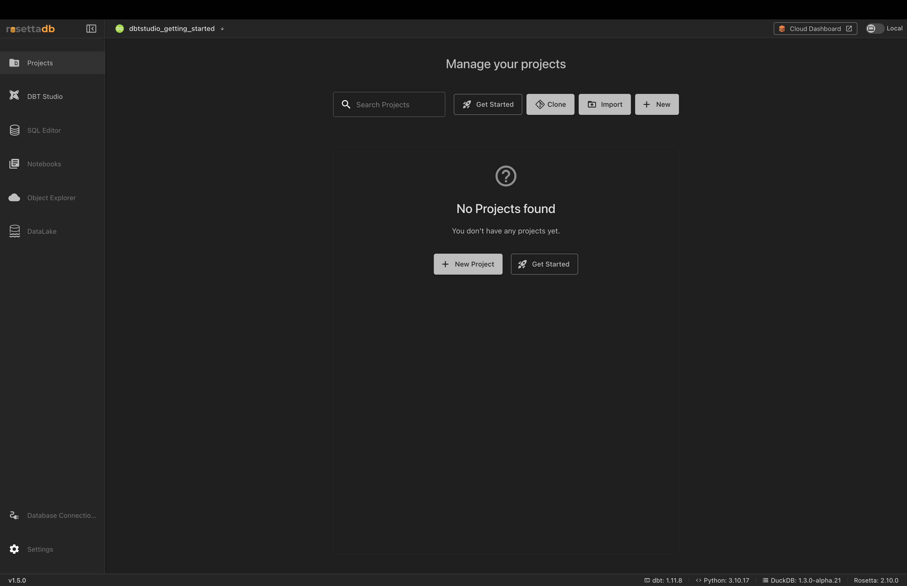

---

## Your First Project

From the Projects screen you have four options at the top:

| Option | When to use it |
|--------|---------------|
| **Get Started** | You're new — loads a sample project with real data so you can explore the app immediately |
| **Clone** | You have an existing project on GitHub you want to work on |
| **Import** | You have a dbt™ project already on your computer |
| **New** | You want to start a fresh dbt™ project from scratch |

If you have no projects yet you will also see **New Project** and **Get Started** buttons in the center of the screen.

If you are new to Rosetta DBT Studio, the best way to get familiar with the app is through the built-in example project. It comes with a pre-configured database, sample data, and ready-to-run models — so you can explore every feature immediately without needing to set anything up. Once you are comfortable with how the app works you can connect your own database and start working with your real data.

---

## Using the Example Project

1. Click **Get Started** on the Projects screen
2. Click **Create Example Project**

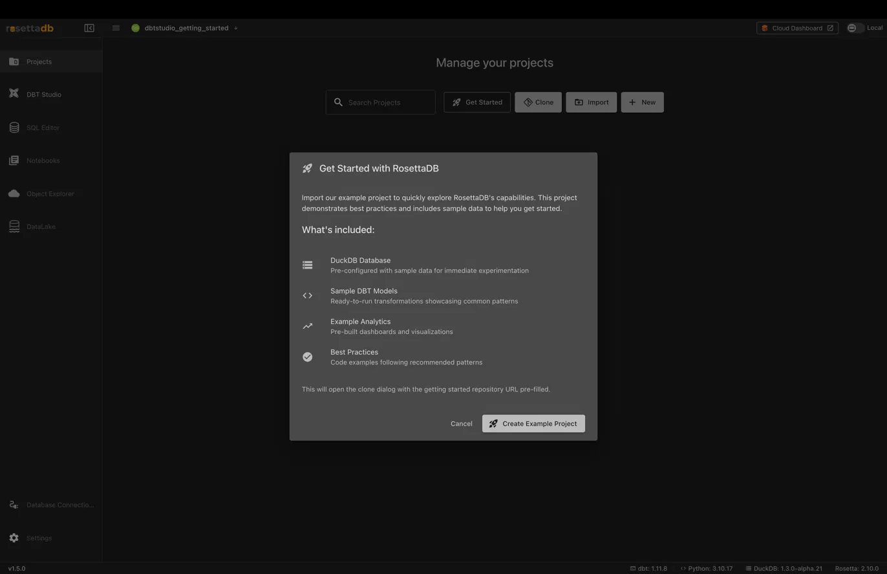

3. The app automatically clones the example repository and sets up a DuckDB database
4. You land on the project workspace — you're ready to go

The example project includes:
- A pre-configured **DuckDB** database
- Sample tables: `students`, `courses`, `enrollments`, `grades`
- Ready-to-run dbt™ models
- Best practice examples

---

## The Project Workspace

Once inside a project you will see the main workspace:

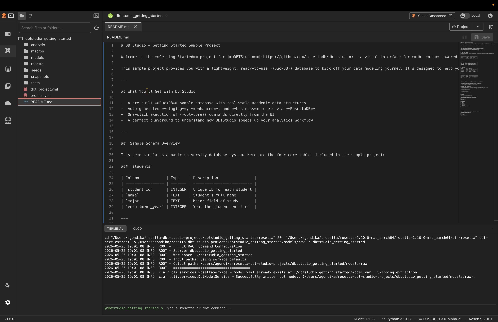

- **Left sidebar** — file explorer showing all your project files and folders
- **Center editor** — where you view and edit your SQL models and YAML files
- **Bottom terminal** — shows the output of every dbt™ and Rosetta command you run
- **Top right Project button** — access all dbt™ commands and layer generators

### AI and Model Buttons

When you open a SQL model file in the editor you will see two additional buttons at the top right — **AI** and **Model**.

**AI button** — gives you AI-powered assistance for the current model file:

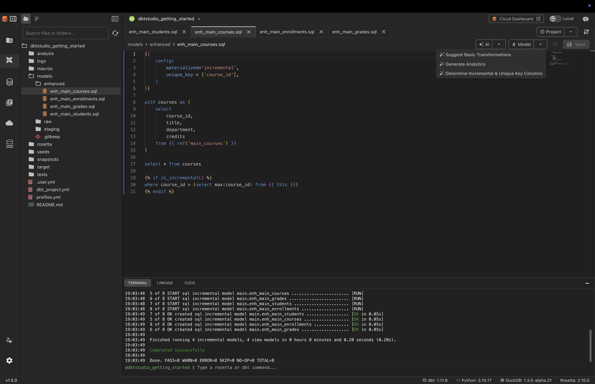

- **Suggest Basic Transformations** — AI analyzes your model and suggests cleaning and transformation improvements
- **Generate Analytics** — AI generates analytical queries based on your data
- **Determine Incremental & Unique Key Columns** — AI analyzes your table and suggests the correct unique key for incremental models

> **Note:** AI features require an AI provider to be configured. See [AI Integration Guide](ai-integration-guide.md) for setup instructions.

**Model button** — run or test just the current model instead of the entire project:

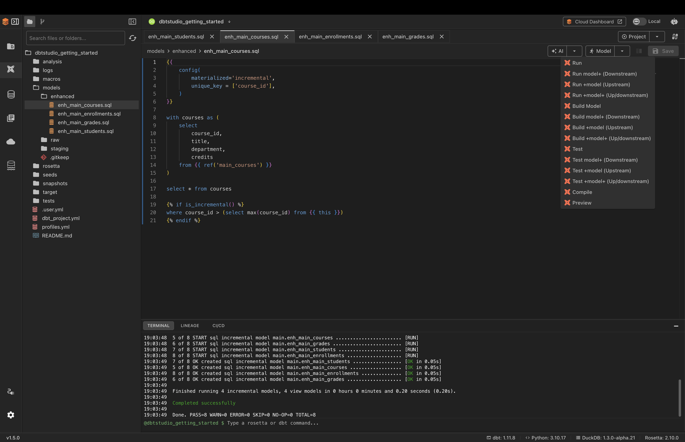

- **Run** — run just this model
- **Run model+ (Downstream)** — run this model and everything that depends on it
- **Run +model (Upstream)** — run this model and everything it depends on
- **Build Model** — run and test this model together
- **Test** — test just this model
- **Compile** — convert Jinja SQL to plain SQL without running
- **Preview** — preview the query results without running the full model

---

## Navigating the Interface

The left sidebar gives you access to every part of the app:

| Screen | What it does |
|--------|-------------|
| **Projects** | Switch between or manage your projects |
| **DBT Studio** | Main workspace — edit models, run dbt™ commands |
| **SQL Editor** | Write and run SQL queries against your database |
| **Notebooks** | Explore data interactively with saved SQL queries |
| **Object Explorer** | Browse cloud storage buckets and files |
| **DataLake** | Create and manage DataLake instances |
| **Database Connections** | Manage your database connections |
| **Settings** | Configure app preferences and AI providers |

---

## Your First Data Transformation

This is the core workflow of Rosetta DBT Studio. You will transform your raw data through three layers — Raw, Staging, and Enhanced — using the **Project** button in the top right.

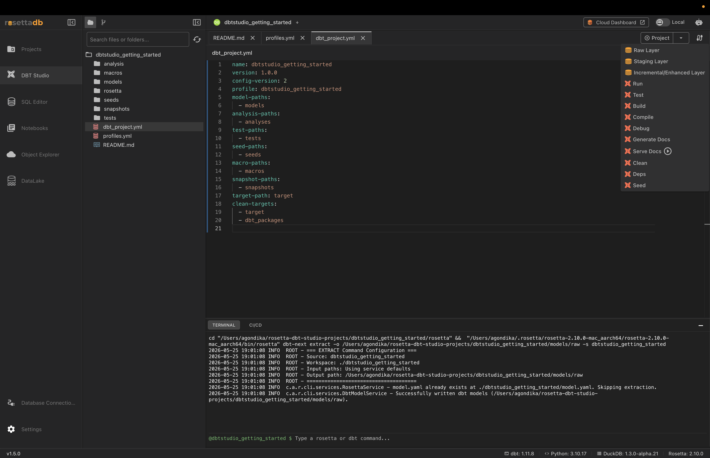

### Step 1 — Generate the Raw Layer

The Raw Layer scans your database and creates YAML files that register your tables as sources. Without this step dbt™ has no idea your tables exist.

1. Click the **Project** button
2. Click **Raw Layer**
3. Confirm the output path and click **Generate Raw Layer**

Rosetta scans your database and creates one YAML file per table inside `models/raw/`. Each file describes the table structure — column names, data types, and basic quality tests.

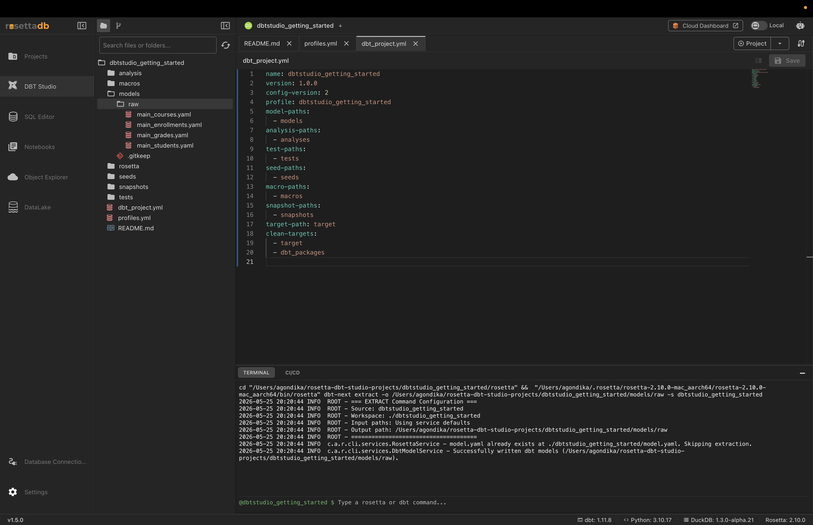

> **What is a YAML source file?** It is a description of your raw table that tells dbt™ "this table exists in your database and here are its columns." Once registered, your SQL models can reference it using `{{ source('main', 'table_name') }}`.

---

### Step 2 — Generate the Staging Layer

The Staging Layer takes your raw tables and generates SQL model files that clean and standardize them — one SQL file per table.

1. Click the **Project** button
2. Click **Staging Layer**
3. Select all YAML files by checking **Select All YAML Files**
4. Click **Generate Staging Models**

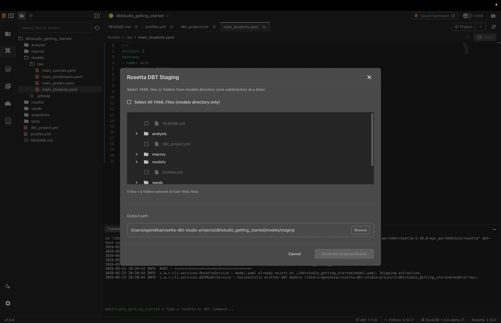

Rosetta generates SQL files inside `models/staging/`. Each file contains a SELECT statement that reads from your raw table and outputs a clean version.

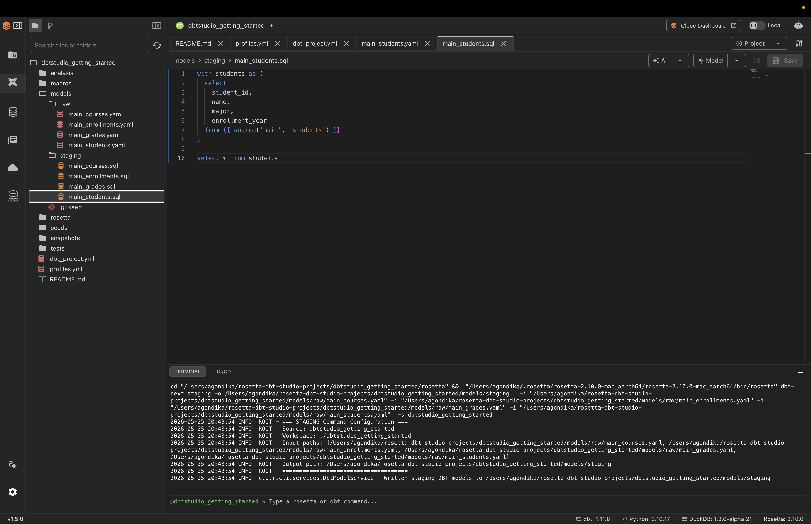

> **Why do staging models exist?** In real projects raw data is often messy — inconsistent formatting, missing values, duplicate rows. The staging layer is where you clean all of that up before doing anything else. You can edit the generated SQL files to add your own cleaning logic.

---

### Step 3 — Run dbt™

Now that your models exist as SQL files you need to execute them against your database to create the actual clean tables.

1. Click the **Project** button
2. Click **Run**

dbt™ executes all your SQL model files against the database in the correct order and creates the clean staging views.

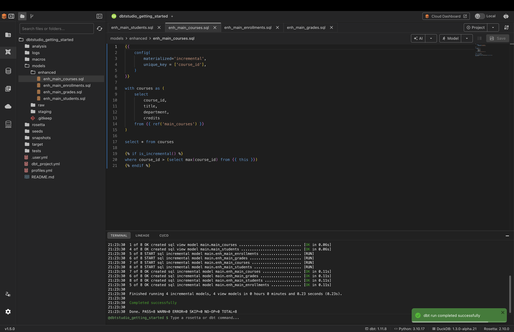

A successful run shows `Completed successfully` in the terminal with a summary:

```
Done. PASS=4 WARN=0 ERROR=0 SKIP=0 TOTAL=4
```

- **PASS** — models that ran successfully
- **ERROR** — models that failed
- **WARN** — models that ran but have warnings
- **SKIP** — models that were skipped

---

### Step 4 — Generate the Enhanced Layer

The Enhanced Layer builds on top of your staging models. It creates incremental models that process only new or changed data each time they run — making your pipeline much more efficient on large datasets.

1. Click the **Project** button
2. Click **Incremental/Enhanced Layer**
3. Select all YAML files and click **Generate Enhanced Models**

Rosetta generates SQL files inside `models/enhanced/`.

> **Note:** Auto-generated Enhanced Layer files use `UNIQUE_KEY_COLUMNS` and `INCREMENTAL_COLUMN` as placeholders. Replace these with your actual column names before running. For example replace `UNIQUE_KEY_COLUMNS` with `['student_id']` for the students table.

After editing the files click **Run** again to execute the enhanced models.

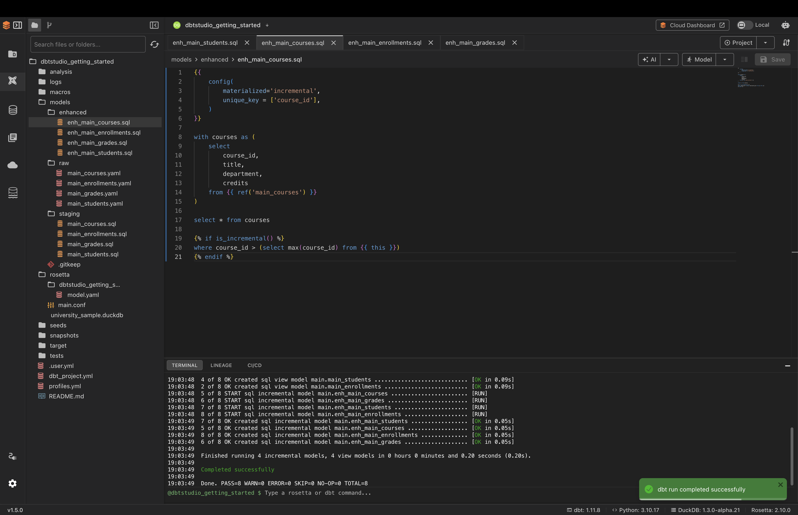

---

### Viewing the Lineage

After running your models click the **Lineage** tab in the bottom panel to see a visual map of how your models connect and depend on each other.

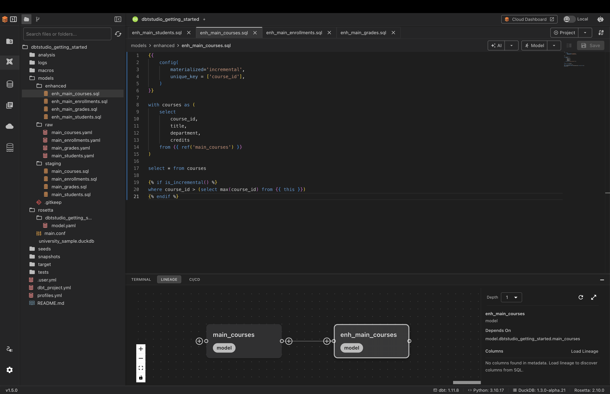

dbt™ uses this dependency map to automatically determine the correct execution order when you click Run.

---

## Connecting Your Own Database

Once you are ready to use your own data:

1. Click **Database Connections** at the bottom of the left sidebar
2. Click **New Connection**
3. Select your database type (DuckDB, PostgreSQL, Snowflake, BigQuery, Redshift, Databricks, or Kinetica)
4. Fill in your connection details
5. Click **Save**

For detailed connection setup instructions see [Connections & Sources](screens/connections.md).

---

## Next Steps

Now that you understand the core workflow:

- [Set up AI assistance](ai-integration-guide.md) — configure an AI provider to unlock AI-powered model generation
- [Learn the DBT Studio workspace](screens/dbt-studio.md) — explore the full project interface in detail
- [Run dbt™ commands](features/dbt-commands.md) — learn Run, Test, Build, Compile and more
- [Model generation in depth](features/model-generation.md) — understand the full Raw → Staging → Enhanced workflow
- [SQL Editor](screens/sql-editor.md) — write and run queries against your database