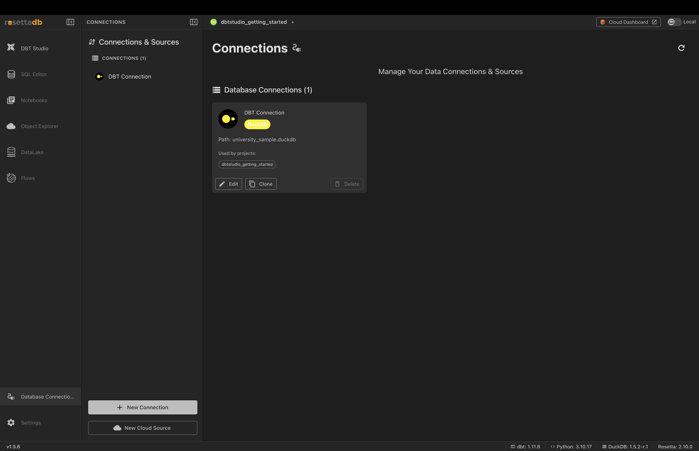
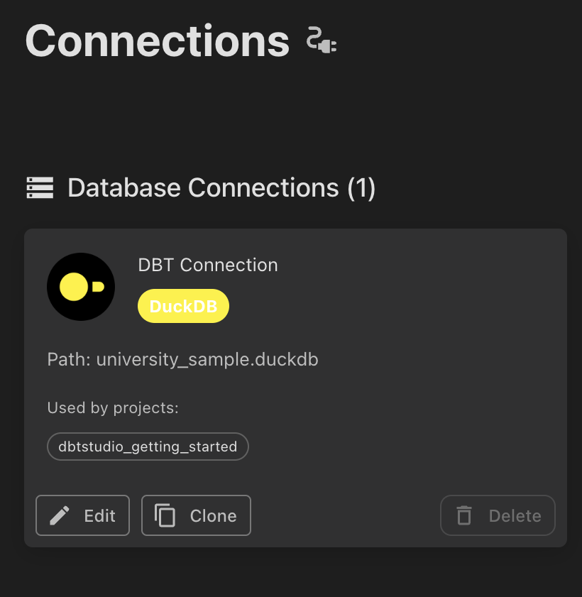
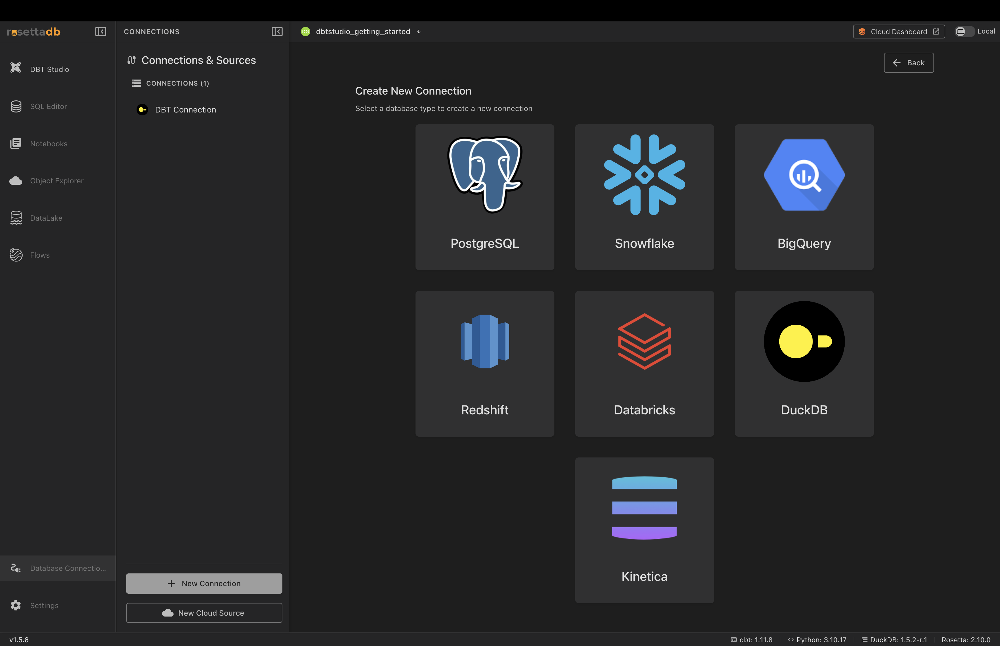
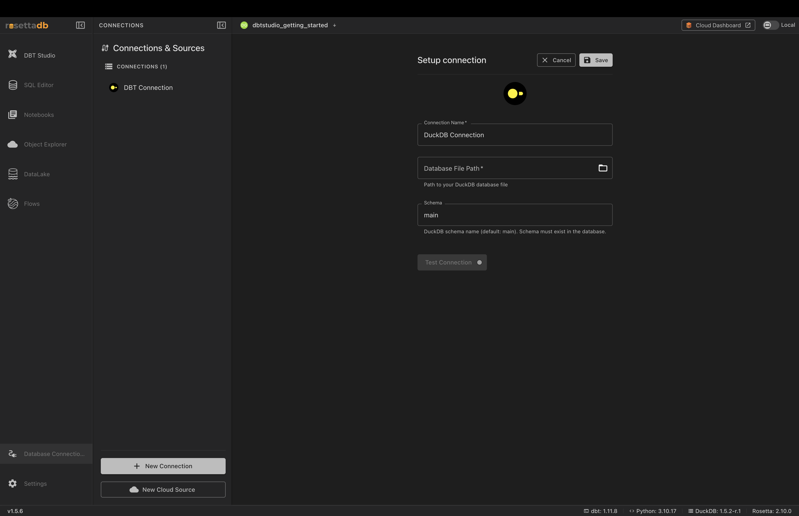

# Database Connections

## Overview

A **connection** is the saved link between Rosetta DBT Studio and a database — where your data lives. dbt™ doesn't store data itself; it transforms data that already sits in a database. So before you can build any models, Rosetta needs to know which database to read from and write to.

You manage all of this from the **Database Connections** screen in the left sidebar.

---

## Supported Databases

Rosetta DBT Studio connects to:

- **PostgreSQL**
- **Snowflake**
- **BigQuery**
- **Redshift**
- **Databricks**
- **DuckDB**
- **Kinetica**

---

## The Connection Card

Each saved connection appears as a card showing its name, database type, path or host, and which projects use it.

Each card has three actions:

- **Edit** — change the connection's settings
- **Clone** — copy the connection to create a new one with the same settings (useful for pointing at a different database without re-entering everything)
- **Delete** — remove the connection

> **Note:** The **Used by projects** list shows which projects rely on a connection. One connection can power multiple projects.

---

## Creating a Connection

### Step 1 — Choose a Database Type

1. Click **New Connection** at the bottom of the panel
2. Select your database type from the grid

---

### Step 2 — Fill in the Connection Details

The fields depend on the database type you picked. For **DuckDB**, you provide:

- **Connection Name** — a label for your reference
- **Database File Path** — the path to your DuckDB file (use the folder icon to browse)
- **Schema** — the schema name (defaults to `main`)

> **Note:** Cloud databases (Snowflake, BigQuery, Redshift, Databricks) ask for host or account details and credentials instead of a file path.

---

### Step 3 — Test and Save

1. Click **Test Connection** to confirm Rosetta can reach the database
2. Click **Save**

Your new connection now appears in the **Database Connections** list, ready to use in a project.

---

## New Cloud Source

The **New Cloud Source** button (below **New Connection**) connects Rosetta to cloud storage rather than a database. See [Cloud Explorer](cloud-explorer.md) for browsing cloud sources.

---

## Common Issues

**Test Connection failed**
→ Check your details are correct — for DuckDB, confirm the file path points to a real `.duckdb` file; for cloud databases, verify the host and credentials.

**Schema must exist error (DuckDB)**
→ The schema name you entered doesn't exist in the database. Use `main`, or create the schema first.