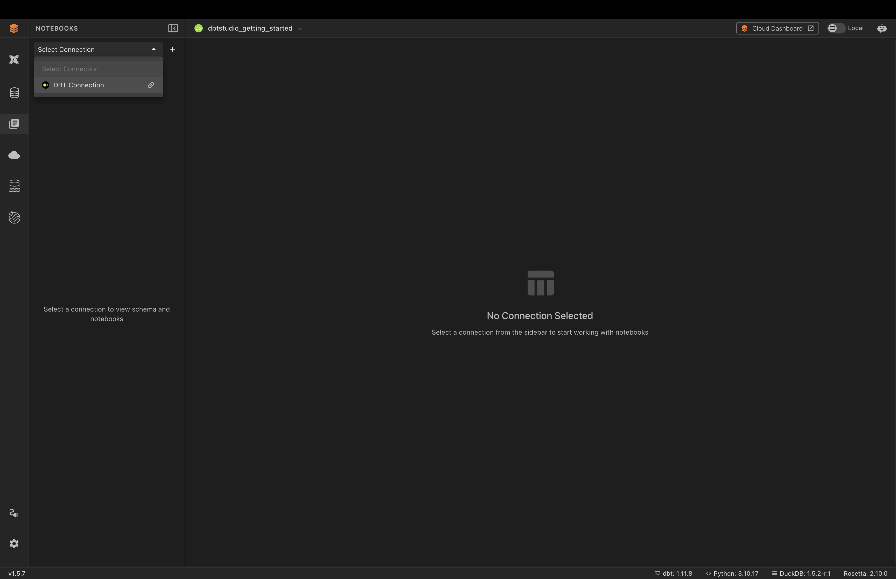
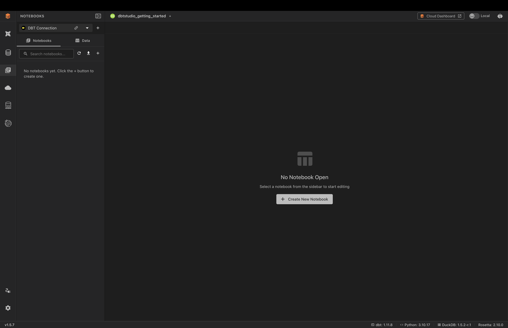
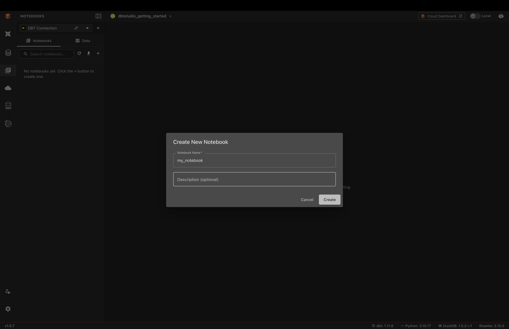
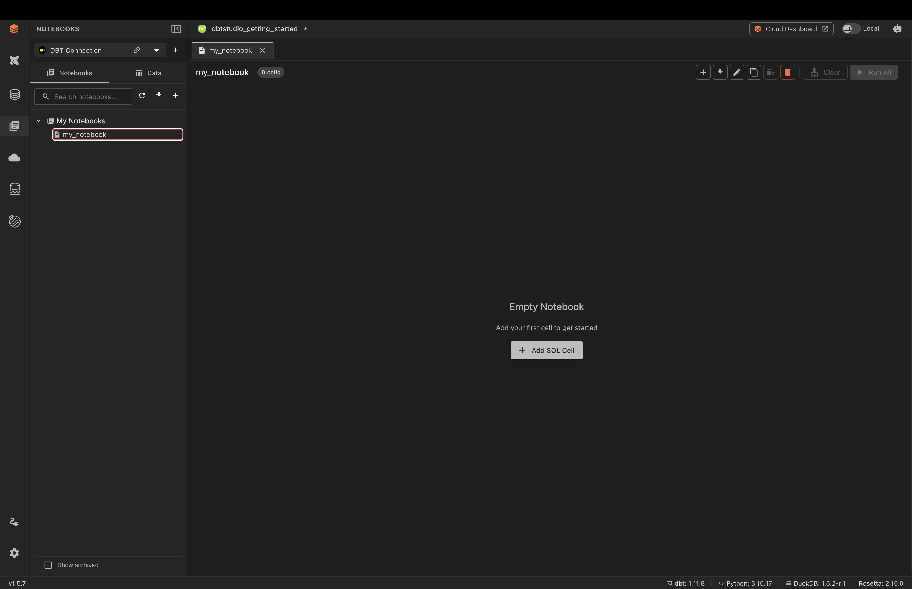
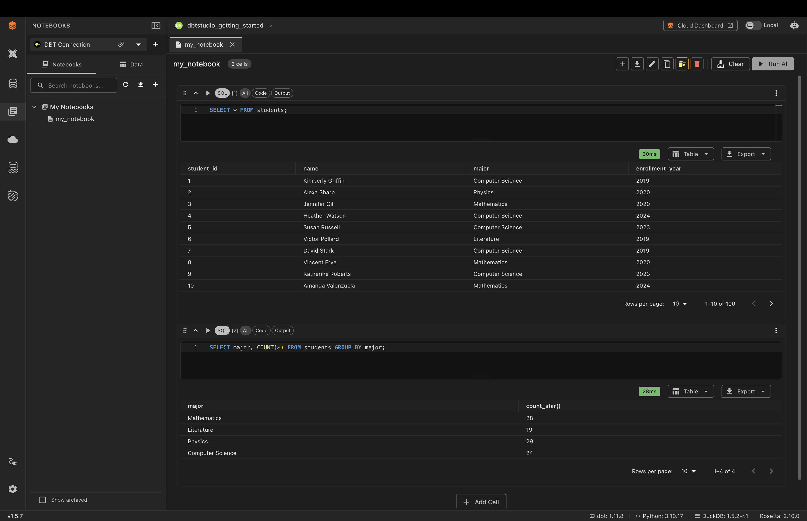
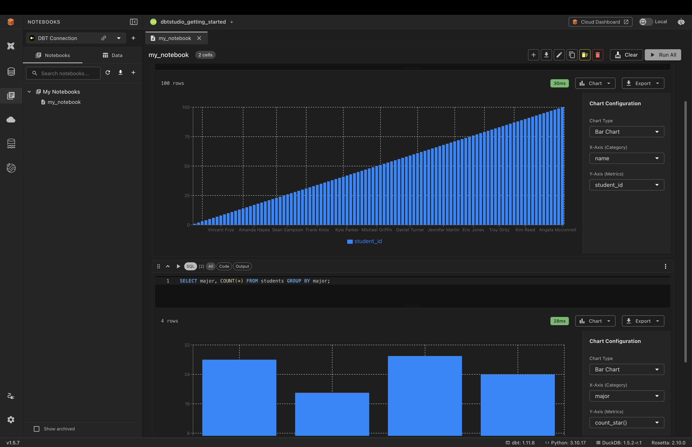

# Notebooks

## Overview

A **notebook** lets you break your SQL work into a series of **cells** — each cell holds its own query and shows its own results right beneath it. You run them one at a time, top to bottom.

If you've used Jupyter notebooks, this is the same idea, focused on SQL: instead of a single query like the [SQL Editor](sql-editor.md), a notebook keeps every step and its result visible, so you can work through a whole analysis and come back to it later.

Notebooks are saved, so you can reopen and share them.

---

## Selecting a Connection

Notebooks read from a database connection, so you pick one first.

Choose a connection from the **Select Connection** dropdown at the top of the panel. Once selected, the panel shows your saved notebooks and a schema browser.

The left panel has two tabs:

- **Notebooks** — lists your saved notebooks under **My Notebooks**. This is where you find, search, and open existing notebooks. You can keep as many as you like here and switch between them.
- **Data** — a browser of the connection's schemas and tables, so you can see what's available to query without leaving the notebook.

---

## Creating a Notebook

1. Click the **+** button (or **Create New Notebook**)
2. Enter a **Notebook Name** and an optional **Description**
3. Click **Create**

The new notebook opens, empty and ready for its first cell.

> **Tip:** You can create multiple notebooks and switch between them from the **Notebooks** tab — for example, one per topic or investigation. Each opens in its own tab at the top.

---

## Working with Cells

1. Click **Add SQL Cell** (or the **+** in the toolbar)
2. Type your SQL in the cell
3. Run the cell with its **Run** (▶) button
4. Click **Add Cell** to add another below, and repeat

Each cell shows its own results underneath, with the query time, a view dropdown (**Table** or **Chart**), **Export**, and pagination. Cells are numbered (`[1]`, `[2]`) in the order they run.

> **Tip:** Use the **All / Code / Output** toggles on a cell to show both the SQL and its results, just the SQL, or just the results.

---

## Viewing a Cell as a Chart

Just like the SQL Editor, each cell's results can be shown as a chart instead of a table.

1. On a cell's result, open the view dropdown and choose **Chart**
2. Use the **Chart Configuration** panel to set the **Chart Type** (Bar, Line, Pie, or Scatter Plot) and the **X-Axis** and **Y-Axis** columns

Because each cell has its own chart, you can build a notebook where different steps of your analysis are visualized in different ways.

---

## Notebook Toolbar

The toolbar at the top right of an open notebook lets you:

- **Add New Cell** — add a new cell
- **Export Notebook** — download the notebook
- **Edit Workbook** — rename or edit its details
- **Duplicate Workbook** — make a copy
- **Delete All Cells** — empty the notebook
- **Delete Workbook** — remove it entirely
- **Clear** — clear all cell outputs
- **Run All** — run every cell top to bottom

---

## Common Issues

**No tables appear / cells return nothing**
→ Confirm a connection is selected at the top of the panel, and that the table names in your SQL exist in the **Data** browser.

**A cell shows an error**
→ Check the SQL syntax in that specific cell — cells run independently.
