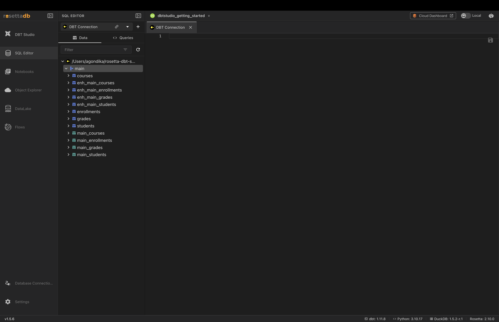
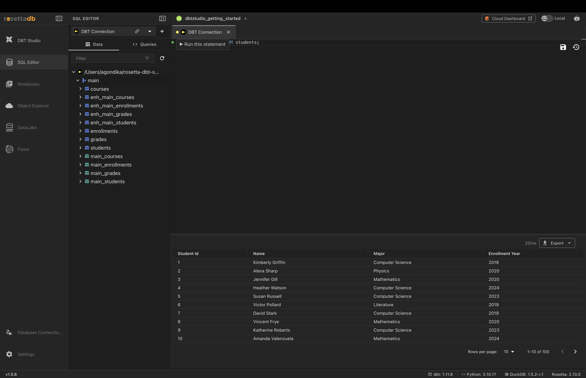
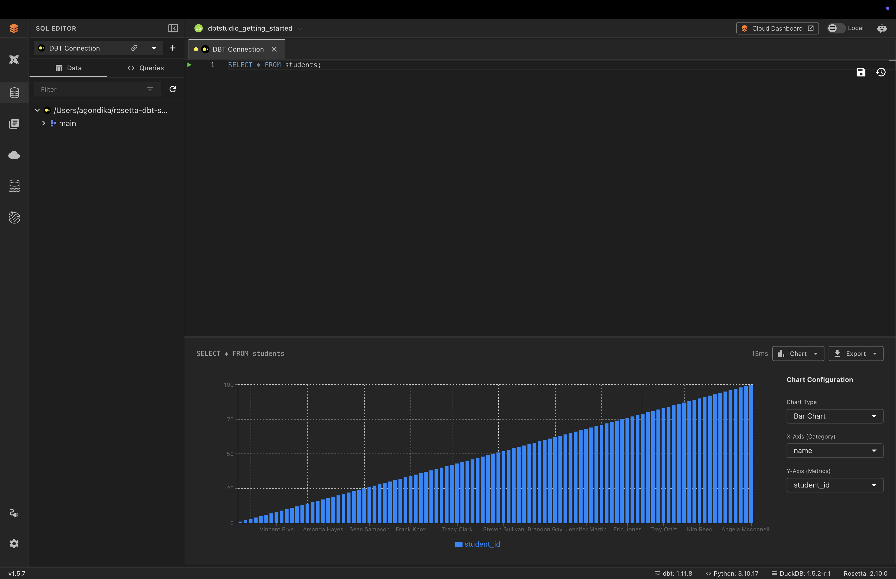

# SQL Editor

## Overview

The **SQL Editor** lets you write and run SQL directly against your connected database. It's where you explore your data — check what's in a table, test a query, or inspect results — without building dbt™ models.

Because it reads from your database connection, make sure you have a connection set up first (see [Database Connections](connections.md)).

---

## The Data Panel

The left panel has two tabs:

- **Data** — a browser of your connection's schemas and tables. Expand a schema (such as `main`) to see every table you can query.
- **Queries** — your saved queries.

Use the **Filter** box to find a table quickly, and the refresh icon to reload the list after your data changes.

---

## Writing and Running a Query

1. Type your SQL in the editor area on the right
2. Click the **Run** (▶) button next to the statement, or press **Cmd/Ctrl + Enter**

Results appear in a table below, along with:

- **Query time** — how long the query took
- **Pagination** — use **Rows per page** and the arrows to page through large result sets
- **Export** — download the results (see below)

> **Tip:** The **Save** and **history** icons at the top right let you save a query for reuse and revisit recently run queries.

---

## Exporting Results

Click **Export** on the results panel to download your query output as:

- **CSV**
- **JSON**
- **Parquet**

---

## Visualizing Results as a Chart

Instead of reading rows in a table, you can turn query results into a chart directly in the editor.

1. Run your query
2. Click the **Chart** toggle next to **Export**
3. Use the **Chart Configuration** panel to set:
   - **Chart Type** — Bar, Line, Pie, or Scatter Plot
   - **X-Axis (Category)** — the column for categories
   - **Y-Axis (Metrics)** — the column for values

The chart updates as you change the configuration, giving you a quick visual of your results without leaving the editor.

---

## Common Issues

**Query returns an error**
→ Check your SQL syntax and confirm the table name exists in the schema shown in the Data panel.

**No tables appear in the Data panel**
→ Confirm your connection is set up correctly on the [Database Connections](connections.md) screen, then click the refresh icon.

**Chart looks wrong or empty**
→ Make sure the columns selected for the X and Y axes suit the chart — the Y-Axis should be a numeric column.